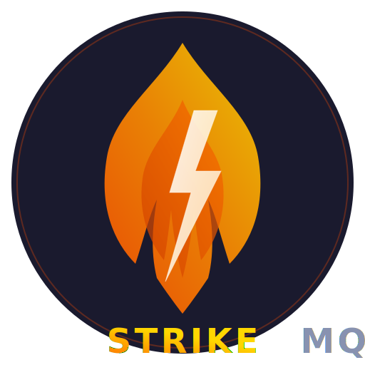

<p align="center">
  
</p>

<h1 align="center">BlazeMQ</h1>

<p align="center">
  Sub-millisecond, Kafka-compatible message broker written in C++20.<br>
  Zero dependencies. Single binary. Drop-in Kafka replacement.
</p>

<p align="center">
  
  
  
  
</p>

---

## Why BlazeMQ?

Kafka is powerful but heavy — JVM, ZooKeeper/KRaft, gigabytes of RAM, slow startup. For local development and testing, you just need something that speaks the Kafka protocol and gets out of the way.

BlazeMQ is a **52KB native binary** that starts in milliseconds, uses 0% CPU when idle, and works with any Kafka client library out of the box.

## Features

- **Kafka wire protocol** — Works with librdkafka, kafka-python, confluent-kafka-go, kcat, and any Kafka client
- **Sub-millisecond produce latency** — Lock-free data structures, memory-mapped storage, zero-copy where possible
- **Zero dependencies** — Pure C++20, no JVM, no ZooKeeper, no third-party libraries
- **Event-driven I/O** — kqueue (macOS) / epoll (Linux), 0% CPU when idle
- **Auto-topic creation** — Topics created on first produce or metadata request
- **Cross-platform** — macOS (Apple Silicon + Intel) and Linux (x86-64)

## Quick Start

### Build

```bash
mkdir -p build && cd build
cmake -DCMAKE_BUILD_TYPE=Release ..
cmake --build .
```

### Run

```bash
./build/blazemq
```

```
═══════════════════════════════════════════
  BlazeMQ v0.1.0 — Sub-Millisecond Broker
═══════════════════════════════════════════
  Platform: macOS (kqueue)
  Port: 9092
═══════════════════════════════════════════

  Listening on 0.0.0.0:9092
Broker ready. Press Ctrl+C to stop.
```

### Produce and Consume with kcat

```bash
# List broker metadata
kcat -b 127.0.0.1:9092 -L

# Produce messages
echo -e "hello\nworld\nblaze" | kcat -b 127.0.0.1:9092 -P -t my-topic

# Consume messages
kcat -b 127.0.0.1:9092 -C -t my-topic -e

# Consume with consumer group
kcat -b 127.0.0.1:9092 -G my-group my-topic
```

### Produce and Consume with Python

```python
from kafka import KafkaProducer, KafkaConsumer

# Produce
producer = KafkaProducer(bootstrap_servers='127.0.0.1:9092')
producer.send('my-topic', b'hello from python')
producer.flush()

# Consume (simple)
consumer = KafkaConsumer('my-topic', bootstrap_servers='127.0.0.1:9092',
                         auto_offset_reset='earliest')
for msg in consumer:
    print(msg.value.decode())
    break

# Consume with consumer group
consumer = KafkaConsumer('my-topic', group_id='my-group',
                         bootstrap_servers='127.0.0.1:9092',
                         auto_offset_reset='earliest')
for msg in consumer:
    print(msg.value.decode())
    break
```

## Performance

| Metric | Value |
|--------|-------|
| Produce latency (p99.9) | < 1ms |
| CPU when idle | 0% |
| Memory footprint | ~1MB + mmap'd segments |
| Startup time | < 10ms |
| Binary size | 52KB |

Run benchmarks: `./build/blazemq_bench`

## Supported Kafka APIs

| API | Versions | Status |
|-----|----------|--------|
| ApiVersions | 0–3 | Full (including flexible versions) |
| Metadata | 0 | Full (auto-topic creation) |
| Produce | 0–5 | Full (persists to disk) |
| Fetch | 0–4 | Full (zero-copy from mmap'd segments) |
| ListOffsets | 0–2 | Full (earliest/latest offset resolution) |
| FindCoordinator | 0–2 | Full (returns self as coordinator) |
| JoinGroup | 0–3 | Full (rebalance protocol, member assignment) |
| SyncGroup | 0–2 | Full (leader distributes partition assignments) |
| Heartbeat | 0–2 | Full (session management, rebalance signaling) |
| LeaveGroup | 0–1 | Full (clean consumer shutdown) |
| OffsetCommit | 0–3 | Full (in-memory offset storage) |
| OffsetFetch | 0–3 | Full (retrieve committed offsets) |
| CreateTopics | 0–3 | Advertised |

## Project Structure

```
├── include/
│   ├── core/types.h              # Broker config, topic types
│   ├── network/tcp_server.h      # Event-driven TCP server
│   ├── protocol/kafka_codec.h    # Kafka encoder/decoder/router
│   ├── storage/partition_log.h   # mmap'd log segments + index
│   ├── storage/consumer_group.h # Consumer group state management
│   └── utils/                    # Ring buffers, memory pool, endian
├── src/
│   ├── main.cpp                  # Broker orchestration
│   ├── network/tcp_server.cpp    # kqueue/epoll implementation
│   └── protocol/kafka_codec.cpp  # Wire protocol codec
├── tests/                        # Unit tests
├── benchmarks/                   # Latency microbenchmarks
└── docs/                         # Architecture, changelog, logo
```

## Running Tests

```bash
cd build && ctest
```

Or individually:

```bash
./blazemq_test_ring    # Lock-free ring buffer
./blazemq_test_pool    # Memory pool allocator
./blazemq_test_codec   # Kafka protocol codec
```

## Documentation

- [Architecture](docs/ARCHITECTURE.md) — System design, layer details, platform support
- [Product Guide](docs/PRODUCT.md) — Full feature reference and configuration
- [Changelog](docs/CHANGELOG.md) — Version history and bug fixes

## Limitations (v0.1.0)

- Consumer group offsets are in-memory only (lost on broker restart)
- No replication (single broker)
- No SASL/SSL authentication
- Single-threaded event loop
- No log compaction or retention enforcement

## License

MIT
